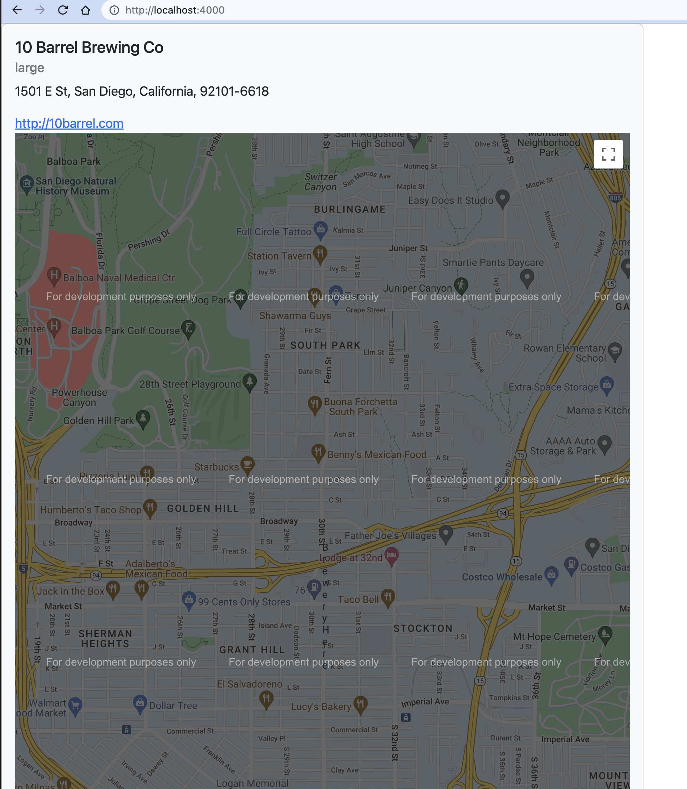

<h1 align="center" style="font-size: 2.7rem;"> Brewery App by Warren Wong
</h1>

A simple React SPA application built upon the [Open Brewery DB API](https://www.openbrewerydb.org/).

<h2 align="center" style="font-size: 1.5rem;">
  
  <br>
</h2>

## Installation

``` javascript
  npm install
  npm run start
  npm run build
```

Go to http://localhost:4000/

## Overview

- Utilized MongoDB as a data store
- NodeJS + Express for server/ REST API
- React.JS + React BootStrap for the client
- Utilize Google Map React to display location


## Database

Utilized MongoDB as a NoSQL database option to store brewery API data in order to be used for future features/

<h2 align="center" style="font-size: 1.5rem;">
  
  <br></h2>


### Brewery Mongoose Schema

```javascript
{
  id: {
    type: String,
    unique: true
  },
  name: String,
  brewery_type: String,
  street: String,
  address_2: String | null,
  address_3: String | null,
  city: String,
  state: String,
  county_province: String | null,
  postal_code: String,
  country: String,
  longitude: String,
  latitude:String,
  phone: String,
  website_url:String,
  updated_at: String,
  created_at: String,
}
```

## Mock Brewery API Data

```JSON
{
    "id": "karl-strauss-brewing-co-downtown-san-diego",
    "name": "Karl Strauss Brewing Co - Downtown",
    "brewery_type": "brewpub",
    "street": "1157 Columbia St",
    "address_2": null,
    "address_3": null,
    "city": "San Diego",
    "state": "California",
    "county_province": null,
    "postal_code": "92101-3511",
    "country": "United States",
    "longitude": "-117.1672838",
    "latitude": "32.71730086",
    "phone": "6192342739",
    "website_url": "http://www.karlstrauss.com",
    "updated_at": "2022-11-11T05:07:58.723Z",
    "created_at": "2022-11-11T05:07:58.723Z"
  }
```

## Future Enhancements

- Toggle Map Feature
- Pagination
- Deployment to cloud (AWS)
